# Reservation Timeline

App web de timeline de reservas con detección de conflictos en tiempo real

---

## Índice

1. [Setup](#setup)
2. [Elección de tecnologías y justificación](#eleccion-de-tecnologias-y-justificacion)
3. [Decisiones de arquitectura](#decisiones-de-arquitectura)
4. [Visión general de las restricciones](#visión-general-de-las-restricciones)
5. [Orden de validación](#orden-de-validación)
6. [Algoritmo 1: Detección de solapamiento (overlap)](#algoritmo-1-detección-de-solapamiento-overlap)
7. [Algoritmo 2: Ventana del timeline](#algoritmo-2-ventana-del-timeline)
8. [Algoritmo 3: Horario de servicio](#algoritmo-3-horario-de-servicio)
9. [Algoritmo 4: Capacidad de mesa](#algoritmo-4-capacidad-de-mesa)
10. [Algoritmo 5: Duración (creación/edición)](#algoritmo-5-duración-creaciónedición)
11. [Flujo completo de validación](#flujo-completo-de-validación)
12. [Uso en drag & drop y preview](#uso-en-drag--drop-y-preview)
13. [Uso en formularios: occupiedTimeRanges y filtrado de horas](#uso-en-formularios-occupiedtimeranges-y-filtrado-de-horas)
14. [Resumen de fórmulas y archivos](#resumen-de-fórmulas-y-archivos)
15. [Limitaciones conocidas](#limitaciones-conocidas)

---

## Setup

Para correr el proyecto en local:

```bash
bun i
bun dev
```

Para cambiar el tamaño del record de la data del mockup, tan solo hay que modificar la constante de `DEFAULT_TIMELINE_COUNT`

La app queda disponible en **[http://localhost:3000](http://localhost:3000)**.

---

## Elección de tecnologías y justificación

Resumen de las decisiones tecnológicas del proyecto y su justificación: por qué se eligió cada herramienta y qué problemas resuelve.

### nuqs: estado en la URL

Los filtros y la configuración de la vista (fecha, modo día/3-day/week, búsqueda, estados, sectores, mesas, zoom) se guardan en la **URL** mediante **nuqs**. Así se aprovecha la URL como fuente de verdad para todo lo “navegable”:

- **Enlaces compartibles**: Copiar el link permite enviar a otro usuario la misma vista (misma fecha, mismos filtros, mismo zoom). No hace falta un estado global ni persistir en localStorage para lograr eso.
- **Navegación del navegador**: Atrás/adelante restaura la combinación anterior de filtros y fecha sin lógica adicional.
- **Marcadores**: El usuario puede guardar una vista concreta como favorito.
- **Menos estado en memoria**: No se duplica en React state lo que ya está en `searchParams`; nuqs parsea y serializa con tipado fuerte y valores por defecto en `core/search-params.ts`.

Alternativas como guardar todo en `useState` o en un store (Zustand, Redux) obligarían a implementar a mano la sincronización con la URL para lograr el mismo comportamiento. nuqs centraliza esa sincronización y se integra con el App Router de Next.js.

---

### React Query: estado de servidor y caché

Los datos del timeline (lista de `ReservationTimelineRecord[]`) se cargan y actualizan con **TanStack React Query**:

- **Separación clara de server state**: Los registros vienen del servidor (mock de datos en nuestro caso); React Query se encarga de caché, deduplicación, y de exponer un contrato único: `useSuspenseQuery` para leer y `setQueryData` para escribir. Así se evita mezclar “datos del servidor” con estado UI en un mismo store.
- **Prefetch e hidratación**: En el page del timeline se hace `prefetchQuery` y `dehydrate`; en cliente, la misma query se resuelve desde la caché hidratada. El usuario no ve un estado de loading inicial por lo que la transición es fluida.
- **Un solo lugar para los registros**: Todas las mutaciones (mover reserva, crear, editar, cambiar estado) actualizan la caché con `setRecords` → `queryClient.setQueryData`. No hay que re-fetchear ni sincronizar varias fuentes; la UI se re-renderiza a partir de esa única fuente de verdad.

React Query encaja con el modelo mental “estado de servidor vs estado de cliente” y reduce la lógica ad hoc de loading/error y de invalidación.

---

### Base UI vía shadcn: componentes listos y accesibles

La UI reutilizable (formularios, modales, selects, tooltips, etc.) se basa en **shadcn/ui** instalado con el CLI, que a su vez usa **Base UI** (@base-ui/react) como primitivos.

- **Componentes listos para usar**: En lugar de implementar desde cero cada control (dropdown, modal, number input), se añaden con el CLI y se personalizan en el repo. El código vive en `components/ui/`.
- **Accesibilidad y ARIA por defecto**: Base UI y los componentes de shadcn vienen con roles, estados y atributos ARIA correctos (focus, expanded, selected, etc.). Eso reduce el trabajo de asegurar teclado y lectores de pantalla y evita errores comunes en componentes hechos a mano.
- **Control total del markup y estilos**: Al ser código propio (no un paquete precompilado), se puede ajustar estructura y clases (Tailwind) sin depender de APIs limitadas de una librería de componentes cerrada.

Se prioriza tener una base accesible y consistente sin dejar de poder personalizar al 100% el aspecto y el comportamiento.

---

### Timeline construido desde cero

El timeline de reservas (grid por fecha/mesa, bloques por reserva, drag, resize, creación por arrastre) **no usa ninguna librería de calendario o timeline**. Se implementó desde cero:

- **Control total**: Cálculo de posiciones (offset en minutos, ancho por duración), snap a slots, ventana visible y scroll sincronizado entre tabla izquierda y grid derecha. Cualquier regla de negocio (horario de servicio, solapamientos, capacidad) se integra en el mismo modelo sin depender de una API externa.
- **Personalización al 100%**: Estilos, zoom, comportamiento del drag y del resize están definidos en el proyecto. No hay que “escapar” de defaults de una librería ni esperar versiones que soporten un caso de uso concreto.
- **Menos dependencias y menor peso de bundle**: Librerías de calendario/timeline suelen ser pesadas y acopladas a un modelo de datos propio. Acá el modelo es explícito (`ReservationTimelineRecord`, slots de 15 min, ventana fija) y la UI está optimizada solo para este dominio.

El costo es más código propio de layout y eventos; a cambio se evita el acoplamiento a una API externa y se mantiene flexibilidad a largo plazo.

---

### dayjs en lugar de date-fns

Para fechas y horas (ventanas del timeline, horario de servicio, intervalos de reservas, parsing y formateo) se usa **dayjs** en lugar de **date-fns**:

- **Performance y tamaño**: dayjs es una librería muy liviana (~2KB min+gzip) y con una API sencilla. Para el volumen de operaciones de este proyecto (parsing de `HH:mm`, diff en minutos, timezone en ventanas), el impacto en bundle y en ejecución es bajo.
- **Sencillez**: La API encadenable (`dayjs().hour(11).minute(0).add(30, 'minute')`) y los plugins (utc, timezone) cubren todo lo necesario sin necesidad de importar muchas funciones sueltas como en date-fns. Menos superficie de API y menos decisiones sobre qué función usar en cada caso.
- **Suficiente para el dominio**: No se requieren características avanzadas de date-fns (locale extenso, formatos complejos); sí se necesita consistencia en timezone y en intervalos. dayjs con los plugins usados cumple ese requisito sin añadir peso innecesario.

La elección prioriza ligereza y simplicidad manteniendo la funcionalidad necesaria para ventanas horarias, slots y validaciones.

---

## Decisiones de arquitectura

Antes de entrar en los algoritmos de conflictos, esta sección resume las decisiones de arquitectura del proyecto: estrategia de rendering, gestión del estado y enfoque de drag & drop.

### Rendering strategy

- **Next.js App Router**: La página del timeline es un **Server Component**. Hace prefetch de los datos del timeline y entrega el árbol ya hidratado vía `HydrationBoundary` + `Suspense`. El contenido bajo `Suspense` (toolbar, vista del timeline) es **client-side**: hooks, interacciones y DnD.
- **Datos del timeline**: Se cargan con **React Query** (`useSuspenseQuery`). En servidor se hace `prefetchQuery` y `dehydrate`; en cliente la misma query se resuelve desde la caché hidratada, sin loading inicial visible. Las mutaciones (mover reserva, crear, editar) actualizan la caché con `setQueryData` (patrón “optimistic-style” local).
- **Client boundary**: Los componentes que necesitan estado o eventos (`TimelineView`, formularios, DnD, filtros) están bajo `"use client"`. No hay renderizado híbrido por componente dentro del timeline: toda la vista es un bloque cliente que consume datos ya prefetcheados.

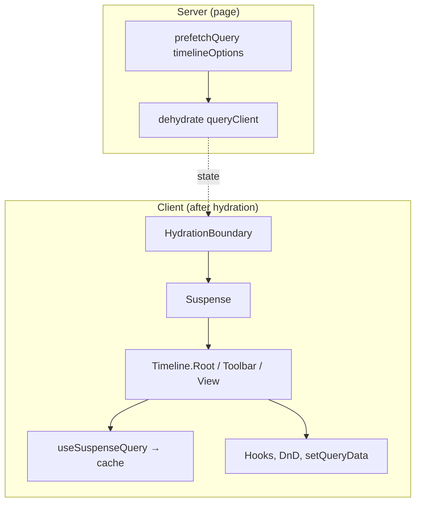


**Archivos clave:**

- `app/timeline/page.tsx`: prefetch, `HydrationBoundary`, `Suspense`, composición de `Timeline`.
- `data/timeline-options.ts`: `queryOptions` con `queryFn` que en servidor usa seed, en cliente llama a `/api/timeline`.
- `app/timeline/components/timeline-view/index.tsx`: `"use client"`, `useSuspenseQuery`, `setTimelineRecords` vía `queryClient.setQueryData`.

---

### State management

El estado se reparte en tres capas: **servidor (React Query)**, **URL (nuqs)** y **estados locales con useState o hooks similares y nativos de React**. No se usa un store global (Zustand, Redux, etc.) ya que nos apoyamos en la URL


| Tipo              | Dónde                | Qué                                                                                                                                                                                                                                        |
| ----------------- | -------------------- | ------------------------------------------------------------------------------------------------------------------------------------------------------------------------------------------------------------------------------------------ |
| **Server state**  | React Query cache    | Lista de `ReservationTimelineRecord[]` (timeline). Se lee con `useSuspenseQuery(timelineOptions)` y se escribe con `queryClient.setQueryData(timelineOptions.queryKey, updater)`.                                                          |
| **URL state**     | nuqs (search params) | Filtros y vista: `view`, `date`, `search`, `status`, `sectors`, `tables`, `zoom`. Tipado y defaults en `core/search-params.ts`; acceso vía `useTimelineQueryState` / `useTimelineFilters()`.                                               |
| **Local state**   | useState             | Selección de reservas (`selectedReservationKeys`), apertura de sectores (`sectorOpenState`), sesión de drag (`activeDrag`), sesión de resize (`activeResize`), scroll sync refs, create draft (ej. `queueOpenDraft`).                      |
| **Actions state** | useReducer           | Flujo de edición/confirmación: `reservationActionsReducer` maneja `editDraft`, `confirmationDraft`, `pendingAction`, `confirmationError`. Concentrado en `useTimelineReservationActions` y hooks de acciones (edit, status, confirmation). |


La única “fuente de verdad” para los registros del timeline es la caché de React Query. Cualquier cambio (drag, crear, editar, cambiar estado) se aplica ahí vía `setRecords`, que por debajo es `setQueryData` sobre `timelineOptions.queryKey`.

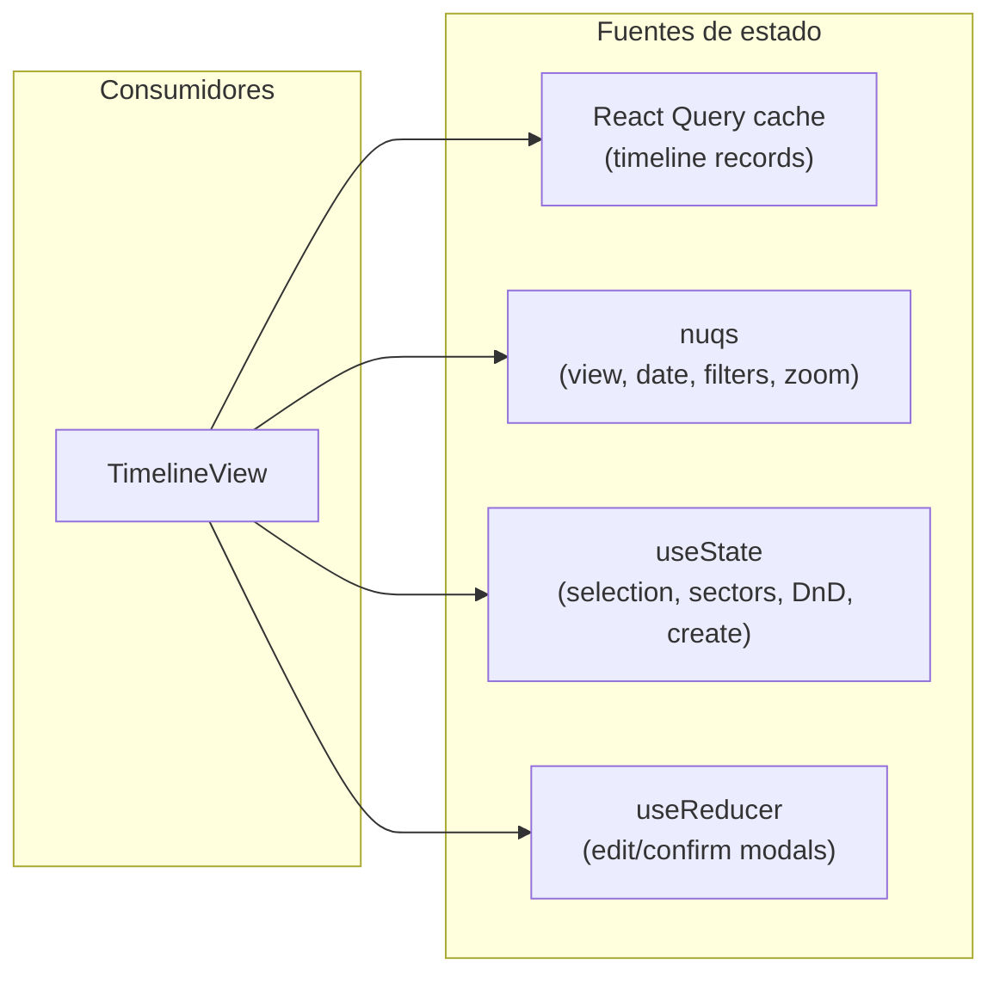


**Archivos clave:**

- `app/timeline/components/timeline-view/index.tsx`: `setTimelineRecords` con `queryClient.setQueryData`; uso de `useTimelineFilters`, `useTimelineZoom`, `useTimelineInteractions`, `useTimelineReservationActions`, etc.
- `core/search-params.ts`: definición de `timelineQueryState` (nuqs) con parsers y defaults.
- `hooks/use-timeline-query-state.ts`: reexport de `timelineQueryState.useQueryState` / `useQueryStates`.
- `app/timeline/components/timeline-view/timeline-actions/state.ts`: `reservationActionsReducer` y tipos de eventos.
- `app/timeline/components/timeline-view/use-timeline-reservation-actions.ts`: composición de hooks de acciones y `useReducer`.

---

### Drag & drop approach

- **Librería**: **@dnd-kit/react**. Se usa `DragDropProvider` para el contexto, `useDraggable` en cada bloque de reserva y `useDroppable` en cada fila (fila = fecha + mesa). El preview del elemento arrastrado se muestra con `DragOverlay`.
- **Move (arrastrar reserva a otra celda/fila)**  
  - Una **sesión de drag** se modela con estado local en `useDragSession`: `activeDrag` (reservationEntityKey, sourceReservation, sourceOffsetMinutes, target, preview).  
  - En `onDragStart` se resuelve la reserva desde `records`, se calcula el offset inicial desde el inicio del timeline y se calcula un preview inicial.  
  - En `onDragMove` / `onDragOver` se actualiza `activeDrag` con el target (fila bajo el puntero) y el `transform.x`; el preview se recalcula con `buildDragPreview` (snap a slots, clamp a ventana, validación con `getMoveValidationReason`).  
  - En `onDragEnd` se obtiene el target final; si el preview es válido (`preview.valid`), se hace commit con `setRecords(commitReservationMove(previous, entityKey, preview.reservation))`. Luego se limpia `activeDrag`.  
  - El **snap** a la grid de 15 minutos se hace con `SnapModifier` del propio @dnd-kit; el tamaño del slot depende del zoom (`SLOT_WIDTH_PX * (zoomPercent / 100)`).
- **Resize (redimensionar reserva por bordes)**  
  - No usa DnD. Se usa una **sesión de resize** en `useResizeSession`: handlers nativos de pointer (`onPointerDown` / `onPointerMove` / `onPointerUp` / `onPointerCancel`) en cada handle de borde.  
  - Se mantiene `activeResize` (reservation, edge, originClientX, preview, etc.). En cada `pointermove` se calcula `buildResizePreview` (delta en slots, clamp por duración min/max y ventana del timeline) y se valida con `getMoveValidationReason`.  
  - Al soltar, si el preview es válido se hace el mismo `commitReservationMove` vía `setRecords`. Resize y drag son mutuamente excluyentes (`isDragActive` desactiva los handles de resize).
- **Crear nueva reserva**  
  - Tampoco usa DnD: **pointer session** en `useCreatePointerSession` / `buildRowCreatePointerHandlers`. Se detecta el arrastre en un área de fila, se calcula el rango de tiempo según el movimiento y se abre el modal de creación con un draft (fecha, mesa, rango inicial). La validación de conflicto se hace al enviar el formulario con `getCreateValidationReason`.

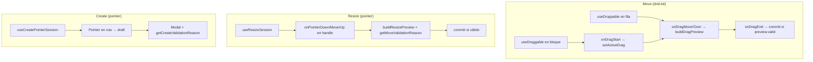


**Archivos clave:**

- `app/timeline/components/timeline-view/timeline-view-providers.tsx`: `DragDropProvider` con `providerHandlers` y `modifiers` (snap).
- `app/timeline/components/timeline-view/use-timeline-reservation-dnd.ts`: orquestador que compone `useDragSession` y `useResizeSession`, expone `providerHandlers`, `getReservationDraggableAttributes`, `getRowDroppableAttributes`, `getResizeHandleProps`.
- `app/timeline/components/timeline-view/timeline-dnd/use-drag-session.ts`: estado `activeDrag`, `handleDragStart` / `handleDragEnd`, `updatePreviewFromOperation`, commit con `commitReservationMove`.
- `app/timeline/components/timeline-view/timeline-dnd/use-resize-session.ts`: estado `activeResize`, handlers de pointer, `buildResizePreview`, commit al soltar.
- `app/timeline/components/timeline-view/timeline-dnd/preview.ts`: `buildDragPreview` (snap, clamp, `getMoveValidationReason`).
- `app/timeline/components/timeline-view/index.tsx`: `SnapModifier.configure({ size: { x: slotWidthByZoom, y: 1 } })`.

---

## Visión general de las restricciones

Una reserva **candidata** (nueva, editada o movida por drag) debe cumplir todas estas restricciones. Si falla alguna, se devuelve una razón de rechazo y se detiene la validación.

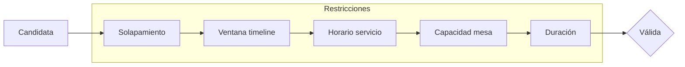


| Restricción                      | Descripción                                                                            | Razón de rechazo                                                | Archivo principal                             |
| -------------------------------- | -------------------------------------------------------------------------------------- | --------------------------------------------------------------- | --------------------------------------------- |
| **Solapamiento**                 | No puede haber dos reservas en la misma mesa con intervalos que se superpongan.        | `overlap`                                                       | `timeline-dnd/validation.ts`                  |
| **Ventana del timeline**         | La reserva debe estar dentro del rango horario visible (ej. 11:00–24:00).              | `outside_timeline`                                              | `domain/timeline-window.ts` + `validation.ts` |
| **Horario de servicio**          | El intervalo debe estar contenido en al menos una ventana de servicio del restaurante. | `outside_service_hours`                                         | `core/service-hours.ts`                       |
| **Capacidad de mesa**            | `partySize` entre `capacity.min` y `capacity.max` de la mesa.                          | `capacity_exceeded`                                             | `validation.ts`                               |
| **Duración** (solo crear/editar) | 30–360 min, múltiplo de 15 min.                                                        | `duration_too_short` / `duration_too_long` / `outside_timeline` | `timeline-create/validation.ts`               |


---

## Orden de validación

Las reglas se evalúan **en secuencia**. La primera que falla determina el resultado; no se siguen comprobando el resto. Eso permite mensajes claros y evita trabajo innecesario.

## Algoritmo 1: Detección de solapamiento (overlap)

### Idea

Dos intervalos **se solapan** si comparten al menos un instante. En la práctica:

- **No** se solapan si uno termina antes de que empiece el otro:  
`A_end <= B_start` **o** `B_end <= A_start`.
- **Sí** se solapan si:  
`A_start < B_end` **y** `A_end > B_start`.

Los extremos se tratan como **exclusivos**: si una reserva termina a las 20:00 y otra empieza a las 20:00, no hay conflicto.

```mermaid
gantt
  title Caso 1: Sin solapamiento (válido)
  dateFormat HH:mm
  axisFormat %H:%M
  section Existente
  Reserva A    :a1, 18:00, 2h
  section Candidata
  Reserva B    :b1, 20:00, 2h
```


```mermaid
gantt
  title Caso 2: Con solapamiento (conflicto)
  dateFormat HH:mm
  axisFormat %H:%M
  section Existente
  Reserva A    :a1, 18:00, 2h
  section Candidata
  Reserva B    :b1, 19:00, 2h
```


```mermaid
gantt
  title Caso 3: Candidata envuelve a existente (conflicto)
  dateFormat HH:mm
  axisFormat %H:%M
  section Candidata
  Reserva B    :b1, 18:00, 4h
  section Existente
  Reserva A    :a1, 19:00, 1h
```


```mermaid
gantt
  title Caso 4: Bordes que se tocan (válido)
  dateFormat HH:mm
  axisFormat %H:%M
  section Existente
  Reserva A    :a1, 18:00, 2h
  section Candidata
  Reserva B    :b1, 20:00, 2h
```


### Validación en drag/create

La comprobación se hace **solo para reservas en la misma mesa** y se **excluye** la reserva que se está moviendo o la clave ficticia de creación.

**Archivo:** `app/timeline/components/timeline-view/timeline-dnd/validation.ts`

```ts
const hasOverlap = targetRecord.reservations.some((reservation) => {
  if (getReservationEntityKey(reservation) === sourceReservationEntityKey) {
    return false;
  }

  if (reservation.tableId !== candidate.tableId) {
    return false;
  }

  const existingStart = dayjs(reservation.startTime);
  const existingEnd = dayjs(reservation.endTime);

  return (
    candidateStart.isBefore(existingEnd) &&
    candidateEnd.isAfter(existingStart)
  );
});

if (hasOverlap) {
  return "overlap";
}
```

- `candidateStart.isBefore(existingEnd)` → el inicio del candidato es anterior al fin del existente (evita el caso “candidato empieza después de que termina el otro”).
- `candidateEnd.isAfter(existingStart)` → el fin del candidato es posterior al inicio del existente (evita el caso “candidato termina antes de que empiece el otro”).
- Juntos equivalen a: `candidateStart < existingEnd && candidateEnd > existingStart`.

### Overlap en el formulario (minutos desde medianoche)

En el formulario los rangos vienen como `{ start: "HH:mm", end: "HH:mm" }`. Se convierten a minutos desde medianoche y se usa la misma lógica.

**Archivo:** `app/timeline/components/timeline-view/timeline-reservation-form-fields.tsx`

```tsx
function rangesOverlap(
  first: { start: number; end: number },
  second: { start: number; end: number },
) {
  return first.start < second.end && first.end > second.start;
}

// Uso: intervalos ocupados desde occupiedTimeRanges
const occupiedIntervals = useMemo<AbsoluteInterval[]>(
  () =>
    occupiedTimeRanges.map((range) => {
      const start = parseHourTime(range.start);
      const end = normalizeAbsoluteEnd(start, parseHourTime(range.end));
      return { start, end };
    }),
  [occupiedTimeRanges],
);

const hasIntervalConflict = useMemo(
  () => (start: number, end: number) =>
    occupiedIntervals.some((interval) =>
      rangesOverlap({ start, end }, interval),
    ),
  [occupiedIntervals],
);
```

`normalizeAbsoluteEnd(start, end)` asegura que si `end <= start` (ej. 23:00 → 01:00) se interprete como cruce de medianoche (`end + 1440`).

---

## Algoritmo 2: Ventana del timeline

### Idea

La reserva debe quedar **dentro** del rango horario que el timeline muestra para esa fecha y timezone. Fuera de ese rango no se puede colocar ni crear.

- **Inicio:** `dateKey` a las `TIMELINE_START_HOUR` (11), en la timezone del restaurante.
- **Fin:** inicio + `TIMELINE_DURATION_MINUTES` (13 horas → hasta las 24:00).

### Constantes

**Archivo:** `core/constants.ts`

```ts
export const TIMELINE_START_HOUR = 11;
export const TIMELINE_END_HOUR = 24;
export const TIMELINE_DURATION_MINUTES =
  (TIMELINE_END_HOUR - TIMELINE_START_HOUR) * 60; // 780
```

### Diagrama

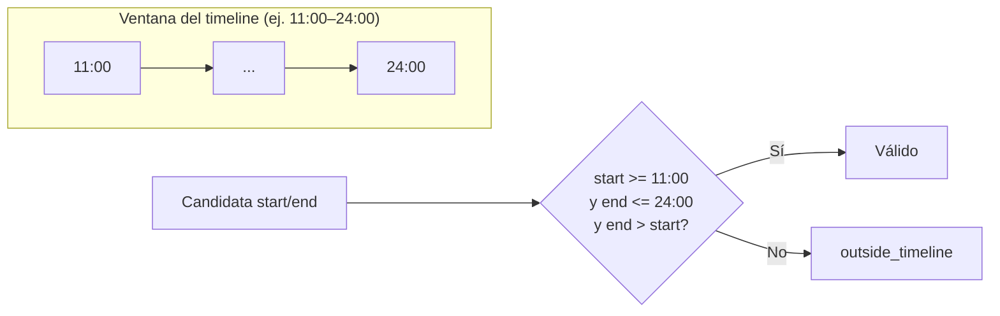


### Cálculo de la ventana

**Archivo:** `app/timeline/components/timeline-view/domain/timeline-window.ts`

```ts
import {
  TIMELINE_DURATION_MINUTES,
  TIMELINE_START_HOUR,
} from "@/core/constants";
import type { DateKey } from "@/core/types";

export function getTimelineWindow(
  dateKey: DateKey,
  timezoneName: string,
): TimelineWindow {
  const timelineStart = dayjs
    .tz(dateKey, timezoneName)
    .hour(TIMELINE_START_HOUR)
    .minute(0)
    .second(0)
    .millisecond(0);

  return {
    timelineStart,
    timelineEnd: timelineStart.add(TIMELINE_DURATION_MINUTES, "minute"),
  };
}
```

### Uso en validación

**Archivo:** `app/timeline/components/timeline-view/timeline-dnd/validation.ts`

```ts
const { timelineStart, timelineEnd } = getTimelineWindow(
  targetDateKey,
  targetRecord.restaurant.timezone,
);

if (
  candidateStart.isBefore(timelineStart) ||
  candidateEnd.isAfter(timelineEnd) ||
  !candidateEnd.isAfter(candidateStart)
) {
  return "outside_timeline";
}
```

Es decir: `candidateStart >= timelineStart`, `candidateEnd <= timelineEnd` y `candidateEnd > candidateStart`.

---

## Algoritmo 3: Horario de servicio

### Idea

El intervalo `[startTime, endTime]` debe estar **completamente contenido** en al menos una ventana de servicio del día (ej. 12:00–15:00 y 19:00–00:00). Si una ventana cruza medianoche (`end <= start`), se interpreta que `end` es del día siguiente.

### Diagrama

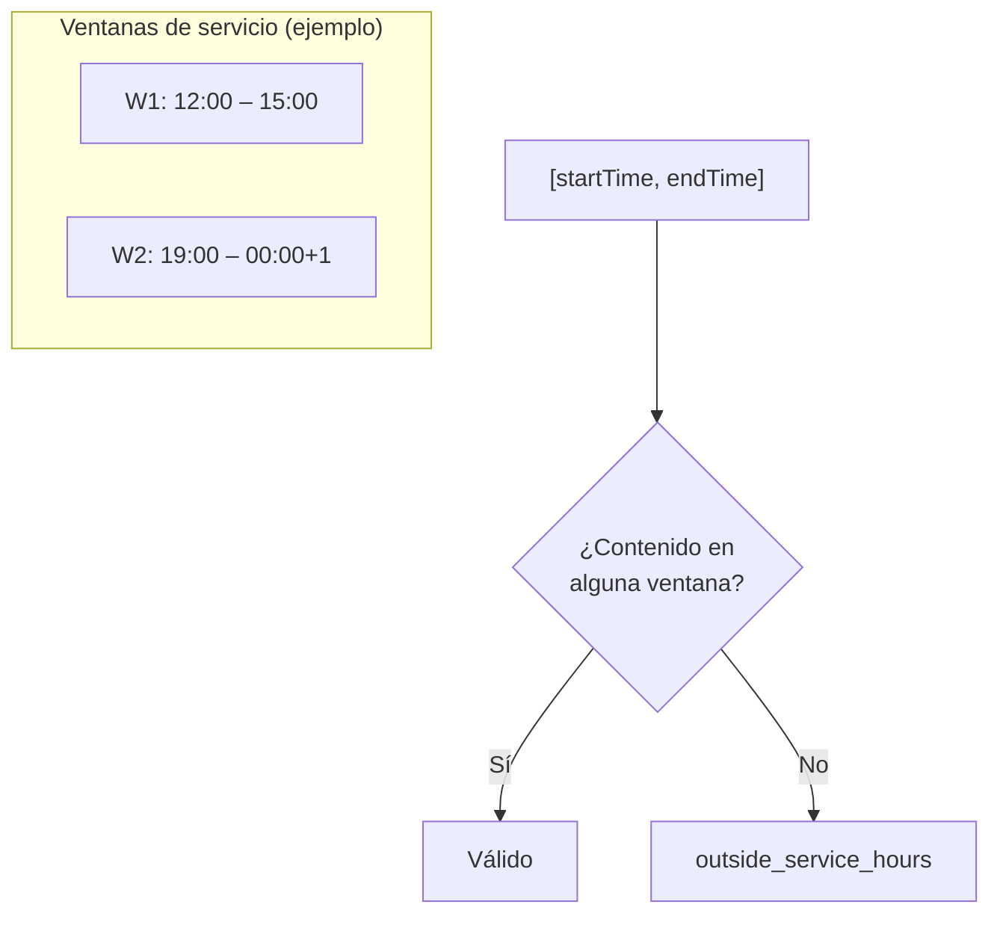


### Ventanas y contención

**Archivo:** `core/service-hours.ts`

```ts
export function getServiceHourWindows(
  dateKey: DateKey,
  serviceHours: ServiceHour[],
  timezoneName: string,
) {
  return serviceHours.map((serviceHour) => {
    const start = parseServiceHourDate(
      dateKey,
      serviceHour.start,
      timezoneName,
    );
    let end = parseServiceHourDate(dateKey, serviceHour.end, timezoneName);

    if (!end.isAfter(start)) {
      end = end.add(1, "day");
    }

    return { start, end };
  });
}

export function isWithinServiceHours(
  startTime: Dayjs,
  endTime: Dayjs,
  dateKey: DateKey,
  serviceHours: ServiceHour[],
  timezoneName: string,
) {
  if (serviceHours.length === 0) {
    return true;
  }

  return getServiceHourWindows(dateKey, serviceHours, timezoneName).some(
    ({ start, end }) =>
      (startTime.isAfter(start) || startTime.isSame(start)) &&
      (endTime.isBefore(end) || endTime.isSame(end)),
  );
}
```

Condición por ventana: `startTime >= start` y `endTime <= end` (incluyendo igualdad en los bordes).

### Uso en validación

**Archivo:** `app/timeline/components/timeline-view/timeline-dnd/validation.ts`

```ts
if (
  !isWithinServiceHours(
    candidateStart,
    candidateEnd,
    targetDateKey,
    targetRecord.restaurant.serviceHours,
    targetRecord.restaurant.timezone,
  )
) {
  return "outside_service_hours";
}
```

---

## Algoritmo 4: Capacidad de mesa

### Idea

El `partySize` de la reserva debe estar entre `table.capacity.min` y `table.capacity.max`. Si la candidata va a otra mesa (drag) o se crea en una mesa, se usa la capacidad de esa mesa.

### Diagrama

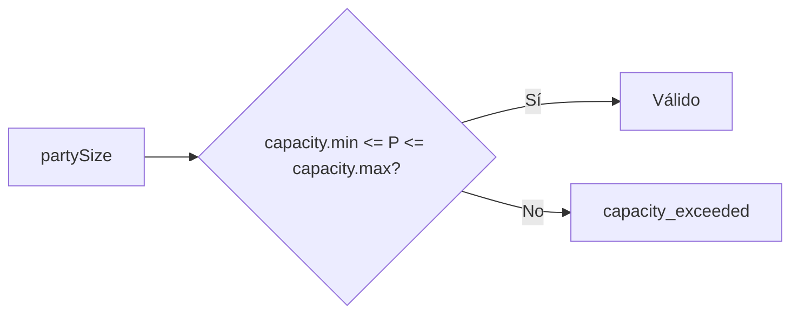


### Código

**Archivo:** `app/timeline/components/timeline-view/timeline-dnd/validation.ts`

```ts
if (
  candidate.partySize < targetTable.capacity.min ||
  candidate.partySize > targetTable.capacity.max
) {
  return "capacity_exceeded";
}
```

---

## Algoritmo 5: Duración (creación/edición)

### Idea

Solo aplica al **crear** (y en la UI de edición, duración mínima/máxima). La duración debe ser:

- Entre `MIN_RESERVATION_MINUTES` (30) y `CREATE_MAX_DURATION_MINUTES` (6 * 60 = 360).
- Múltiplo de `SLOT_MINUTES` (15).

### Código

**Archivo:** `app/timeline/components/timeline-view/timeline-create/validation.ts`

```ts
import { MIN_RESERVATION_MINUTES, SLOT_MINUTES } from "@/core/constants";

const CREATE_MAX_DURATION_MINUTES = 6 * 60;
const CREATE_RESERVATION_ENTITY_KEY = "__timeline-create__";

export function getCreateValidationReason({
  candidate,
  targetDateKey,
  targetTable,
  targetRecord,
}: { ... }): TimelineCreateValidationReason | undefined {
  if (candidate.durationMinutes < MIN_RESERVATION_MINUTES) {
    return "duration_too_short";
  }

  if (candidate.durationMinutes > CREATE_MAX_DURATION_MINUTES) {
    return "duration_too_long";
  }

  if (candidate.durationMinutes % SLOT_MINUTES !== 0) {
    return "outside_timeline";
  }

  return getMoveValidationReason({
    candidate,
    targetDateKey,
    targetTable,
    targetRecord,
    sourceReservationEntityKey: CREATE_RESERVATION_ENTITY_KEY,
  });
}
```

Si pasa las tres comprobaciones de duración, se delega en `getMoveValidationReason` (timeline, capacity, service hours, overlap).

---

## Flujo completo de validación

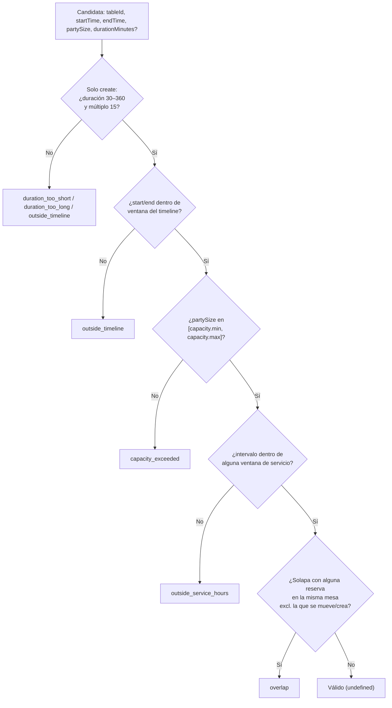


---

## Uso en drag & drop y preview

### Validación al soltar

`getMoveValidationReason` se usa al decidir si un movimiento de reserva es válido. La candidata es la reserva con `tableId`, `startTime` y `endTime` del destino.

### Preview en tiempo real

Mientras se arrastra, se calcula un preview con la nueva posición (snap a slots de 15 min, clamp a la ventana del timeline) y se valida esa candidata para mostrar estado visual (ej. rojo si hay conflicto).

**Archivo:** `app/timeline/components/timeline-view/timeline-dnd/preview.ts`

```ts
const startTime = timelineStart.add(nextOffsetMinutes, "minute");
const endTime = startTime.add(sourceReservation.durationMinutes, "minute");
const candidate: SelectionReservation = {
  ...sourceReservation,
  tableId: target.tableId,
  startTime: startTime.format(),
  endTime: endTime.format(),
};

const reason = getMoveValidationReason({
  candidate,
  targetDateKey: target.dateKey,
  targetTable,
  targetRecord,
  sourceReservationEntityKey: reservationEntityKey,
});

return {
  reservation: candidate,
  timelineStart,
  timelineEnd,
  valid: !reason,
  reason,
};
```

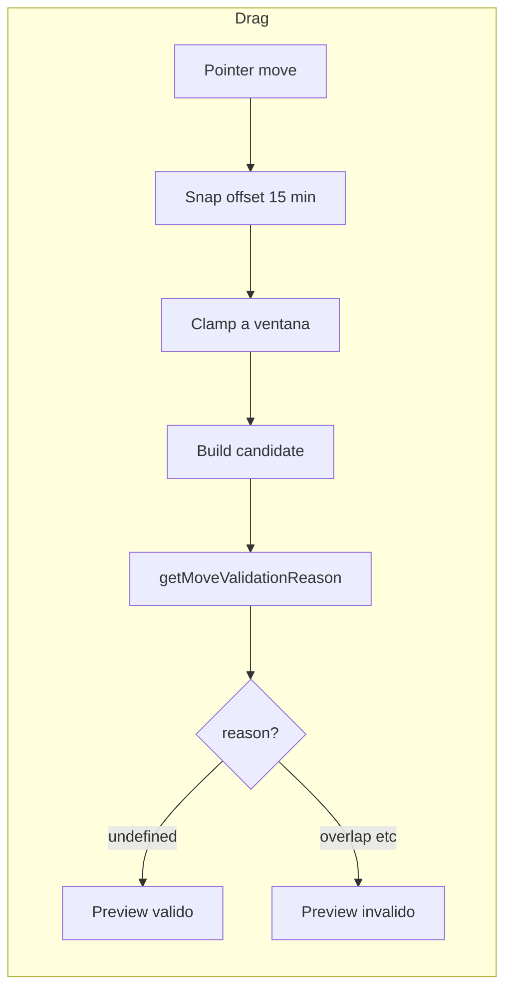


## Uso en formularios: occupiedTimeRanges y filtrado de horas

### Construcción de occupiedTimeRanges

Para **crear** reserva en una mesa, se pasan al formulario los rangos ya ocupados en esa mesa ese día (en formato "HH:mm"). Para **editar**, se pasan los de la misma mesa **excluyendo** la reserva que se edita.

**Crear — Archivo:** `app/timeline/components/timeline-view/timeline-create/use-create-draft.ts`

```ts
occupiedTimeRanges: draftState.targetRecord.reservations
  .filter((reservation) => reservation.tableId === draftState.table.id)
  .map((reservation) => ({
    start: dayjs(reservation.startTime).format("HH:mm"),
    end: dayjs(reservation.endTime).format("HH:mm"),
  })),
```

**Editar — Archivo:** `app/timeline/components/timeline-view/timeline-actions/use-edit-actions.ts`

```ts
occupiedTimeRanges:
  record?.reservations
    .filter(
      (timelineReservation) =>
        timelineReservation.tableId === reservation.tableId &&
        getReservationEntityKey(timelineReservation) !== reservationEntityKey,
    )
    .map((timelineReservation) => ({
      start: dayjs(timelineReservation.startTime).format("HH:mm"),
      end: dayjs(timelineReservation.endTime).format("HH:mm"),
    })) ?? [],
```

### Filtrado de opciones “From” y “To”

El formulario construye grupos de opciones de hora según las ventanas de servicio. Luego **filtra** qué horas de inicio (From) y fin (To) ofrecer para que **ningún par (from, to) solape** con `occupiedIntervals`. Así el usuario no puede elegir un rango que ya esté ocupado.

**Archivo:** `app/timeline/components/timeline-view/timeline-reservation-form-fields.tsx`

```tsx
// Opciones de "From": solo horas desde las que existe al menos un "To" válido
// (duración permitida y sin solapamiento con ocupados)
const fromOptionGroups = useMemo(
  () =>
    filterTimeOptionGroups(timeOptionGroups, (option) => {
      if (
        lastOptionAbsoluteMinutes === null ||
        option.absoluteMinutes >= lastOptionAbsoluteMinutes
      ) {
        return false;
      }
      return allTimeOptions.some(
        (endOption) =>
          endOption.absoluteMinutes > option.absoluteMinutes &&
          isDurationAllowed(
            option.absoluteMinutes,
            endOption.absoluteMinutes,
          ) &&
          !hasIntervalConflict(
            option.absoluteMinutes,
            endOption.absoluteMinutes,
          ),
      );
    }),
  [allTimeOptions, hasIntervalConflict, lastOptionAbsoluteMinutes, timeOptionGroups],
);

// Opciones de "To": solo horas > from, duración permitida, sin solapamiento
const toOptionGroups = useMemo(() => {
  if (fromAbsoluteMinutes === null) {
    return [];
  }
  return filterTimeOptionGroups(timeOptionGroups, (option) => {
    if (option.absoluteMinutes <= fromAbsoluteMinutes) {
      return false;
    }
    if (!isDurationAllowed(fromAbsoluteMinutes, option.absoluteMinutes)) {
      return false;
    }
    return !hasIntervalConflict(fromAbsoluteMinutes, option.absoluteMinutes);
  });
}, [fromAbsoluteMinutes, hasIntervalConflict, timeOptionGroups]);
```

Además, un `useEffect` limpia el valor de "To" si el par (from, to) actual pasa a solapar con algún ocupado (por ejemplo tras cambiar "From").

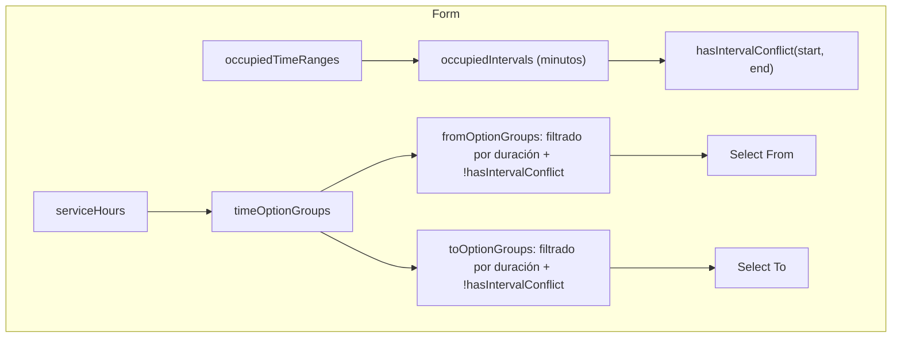


---

## Limitaciones conocidas

### Datos locales y record del timeline

El manejo de datos se basa en **datos locales**: no hay persistencia en base de datos ni API real de reservas. La fuente de verdad es un array en memoria que React Query rehidrata desde el servidor o desde la respuesta de `/api/timeline`.

Cada elemento de ese array es un **record del timeline** (`ReservationTimelineRecord`): un objeto que representa **un día completo** de la grilla. Contiene:

- `date`: la fecha (DateKey, ej. `"2025-10-15"`)
- `restaurant`: configuración del restaurante (timezone, horarios de servicio)
- `sectors`: sectores (Main Hall, Terrace, Bar, etc.) con nombre, color y orden
- `tables`: mesas con capacidad min/max y sector
- `reservations`: todas las reservas de ese día (cada una con mesa, cliente, horario, estado, prioridad, etc.)

Es decir, un record = un día + restaurante + sectores + mesas + reservas del día. La grilla muestra varios de estos records (según el modo vista: día, 3 días, semana).

Esos datos se generan mediante una **función de seed** (`createSeedData`, en `data/create-seed-data.ts`): recibe un número `count` (días a generar) y devuelve un array de `ReservationTimelineRecord[]`. Para cada día se crea un restaurante aleatorio (nombre, timezone fijo, horarios de servicio), sectores y mesas fijas a partir de templates, y reservas aleatorias que respetan horario de servicio y evitan solapamientos en la misma mesa (misma lógica de overlap que en la app). En servidor la query usa directamente `createSeedData(DEFAULT_TIMELINE_COUNT)`; en cliente se puede usar la misma seed o una ruta `/api/timeline` que devuelve JSON.

### Mutaciones y algoritmos en una app real

Todas las **mutaciones** (crear, editar, mover, cambiar estado, cancelar, eliminar) y gran parte de los **algoritmos** descritos en este README (detección de conflictos, horario de servicio, capacidad) en una aplicación real se delegarían en el **backend**: persistencia en base de datos, reglas de negocio en el servidor, y posiblemente validación y mensajes de error desde la API. En este proyecto se simplificó a un modelo **local**: las mutaciones solo actualizan la caché de React Query (`setQueryData`) y las validaciones se ejecutan en el cliente. Sirve para demostrar la lógica y la UX del timeline, pero no como arquitectura de producción con persistencia.

### Decisiones de UI y carga cognitiva

La UI se ha respetado en gran medida respecto al challenge, pero se tomaron decisiones conscientes para **reducir la carga cognitiva** y mejorar la UX. Un ejemplo: **no se añadieron líneas verticales marcadas (bold) para cada hora** en el grid del timeline, para no saturar visualmente la grilla y mantener el foco en los bloques de reservas. Otras elecciones de layout y densidad siguen el mismo criterio: legibilidad y claridad por encima de maximizar elementos en pantalla.

### Mobile

La interfaz de este challenge **no está preparada para funcionar correctamente en mobile**. El timeline está pensado para viewports de escritorio (grilla ancha, drag & drop, scroll horizontal/vertical, modales). No se han implementado breakpoints, vista adaptada ni gestos táctiles para uso en móvil; es una limitación conocida del alcance actual.

### Bonus y alcance del entregable

Los distintos **bonus** del challenge no han sido tenidos en cuenta en este repo. Estoy en proceso de otros tres challenges en paralelo y no he tenido tiempo de cerrar todo lo opcional. Preferí entregar lo antes posible el core bien prolijo con excelente UX y performance para poder discutir más detalles cuanto antes, dado que es uno de los challenges más extensos.

## Screenshots


